Inspecciónn de los datos
------------------------

    required_packages <- c("ggplot2", "dplyr", "caret", "kernlab", "glmnet")
    new_packages <- required_packages[!(required_packages %in% installed.packages()[,"Package"])]
    if(length(new_packages)) install.packages(new_packages)
    # library(pls)
    library(ggplot2)
    library(dplyr)

    ## 
    ## Attaching package: 'dplyr'

    ## The following objects are masked from 'package:stats':
    ## 
    ##     filter, lag

    ## The following objects are masked from 'package:base':
    ## 
    ##     intersect, setdiff, setequal, union

    library(caret)

    ## Loading required package: lattice

    library(kernlab)

    ## 
    ## Attaching package: 'kernlab'

    ## The following object is masked from 'package:ggplot2':
    ## 
    ##     alpha

    library(glmnet)

    ## Loading required package: Matrix

    ## Loading required package: foreach

    ## Loaded glmnet 2.0-13

    train <- read.csv("train.csv")
    test <- read.csv("test.csv")

Las dimensiones del conjunto de entrenamiento son las siguientes:

    dim(train)

    ## [1] 1460   81

    dim(test)

    ## [1] 1459   80

A continuacin, procedemos a examinar las variables del dataset:

    str(train)

    ## 'data.frame':    1460 obs. of  81 variables:
    ##  $ Id           : int  1 2 3 4 5 6 7 8 9 10 ...
    ##  $ MSSubClass   : int  60 20 60 70 60 50 20 60 50 190 ...
    ##  $ MSZoning     : Factor w/ 5 levels "C (all)","FV",..: 4 4 4 4 4 4 4 4 5 4 ...
    ##  $ LotFrontage  : int  65 80 68 60 84 85 75 NA 51 50 ...
    ##  $ LotArea      : int  8450 9600 11250 9550 14260 14115 10084 10382 6120 7420 ...
    ##  $ Street       : Factor w/ 2 levels "Grvl","Pave": 2 2 2 2 2 2 2 2 2 2 ...
    ##  $ Alley        : Factor w/ 2 levels "Grvl","Pave": NA NA NA NA NA NA NA NA NA NA ...
    ##  $ LotShape     : Factor w/ 4 levels "IR1","IR2","IR3",..: 4 4 1 1 1 1 4 1 4 4 ...
    ##  $ LandContour  : Factor w/ 4 levels "Bnk","HLS","Low",..: 4 4 4 4 4 4 4 4 4 4 ...
    ##  $ Utilities    : Factor w/ 2 levels "AllPub","NoSeWa": 1 1 1 1 1 1 1 1 1 1 ...
    ##  $ LotConfig    : Factor w/ 5 levels "Corner","CulDSac",..: 5 3 5 1 3 5 5 1 5 1 ...
    ##  $ LandSlope    : Factor w/ 3 levels "Gtl","Mod","Sev": 1 1 1 1 1 1 1 1 1 1 ...
    ##  $ Neighborhood : Factor w/ 25 levels "Blmngtn","Blueste",..: 6 25 6 7 14 12 21 17 18 4 ...
    ##  $ Condition1   : Factor w/ 9 levels "Artery","Feedr",..: 3 2 3 3 3 3 3 5 1 1 ...
    ##  $ Condition2   : Factor w/ 8 levels "Artery","Feedr",..: 3 3 3 3 3 3 3 3 3 1 ...
    ##  $ BldgType     : Factor w/ 5 levels "1Fam","2fmCon",..: 1 1 1 1 1 1 1 1 1 2 ...
    ##  $ HouseStyle   : Factor w/ 8 levels "1.5Fin","1.5Unf",..: 6 3 6 6 6 1 3 6 1 2 ...
    ##  $ OverallQual  : int  7 6 7 7 8 5 8 7 7 5 ...
    ##  $ OverallCond  : int  5 8 5 5 5 5 5 6 5 6 ...
    ##  $ YearBuilt    : int  2003 1976 2001 1915 2000 1993 2004 1973 1931 1939 ...
    ##  $ YearRemodAdd : int  2003 1976 2002 1970 2000 1995 2005 1973 1950 1950 ...
    ##  $ RoofStyle    : Factor w/ 6 levels "Flat","Gable",..: 2 2 2 2 2 2 2 2 2 2 ...
    ##  $ RoofMatl     : Factor w/ 8 levels "ClyTile","CompShg",..: 2 2 2 2 2 2 2 2 2 2 ...
    ##  $ Exterior1st  : Factor w/ 15 levels "AsbShng","AsphShn",..: 13 9 13 14 13 13 13 7 4 9 ...
    ##  $ Exterior2nd  : Factor w/ 16 levels "AsbShng","AsphShn",..: 14 9 14 16 14 14 14 7 16 9 ...
    ##  $ MasVnrType   : Factor w/ 4 levels "BrkCmn","BrkFace",..: 2 3 2 3 2 3 4 4 3 3 ...
    ##  $ MasVnrArea   : int  196 0 162 0 350 0 186 240 0 0 ...
    ##  $ ExterQual    : Factor w/ 4 levels "Ex","Fa","Gd",..: 3 4 3 4 3 4 3 4 4 4 ...
    ##  $ ExterCond    : Factor w/ 5 levels "Ex","Fa","Gd",..: 5 5 5 5 5 5 5 5 5 5 ...
    ##  $ Foundation   : Factor w/ 6 levels "BrkTil","CBlock",..: 3 2 3 1 3 6 3 2 1 1 ...
    ##  $ BsmtQual     : Factor w/ 4 levels "Ex","Fa","Gd",..: 3 3 3 4 3 3 1 3 4 4 ...
    ##  $ BsmtCond     : Factor w/ 4 levels "Fa","Gd","Po",..: 4 4 4 2 4 4 4 4 4 4 ...
    ##  $ BsmtExposure : Factor w/ 4 levels "Av","Gd","Mn",..: 4 2 3 4 1 4 1 3 4 4 ...
    ##  $ BsmtFinType1 : Factor w/ 6 levels "ALQ","BLQ","GLQ",..: 3 1 3 1 3 3 3 1 6 3 ...
    ##  $ BsmtFinSF1   : int  706 978 486 216 655 732 1369 859 0 851 ...
    ##  $ BsmtFinType2 : Factor w/ 6 levels "ALQ","BLQ","GLQ",..: 6 6 6 6 6 6 6 2 6 6 ...
    ##  $ BsmtFinSF2   : int  0 0 0 0 0 0 0 32 0 0 ...
    ##  $ BsmtUnfSF    : int  150 284 434 540 490 64 317 216 952 140 ...
    ##  $ TotalBsmtSF  : int  856 1262 920 756 1145 796 1686 1107 952 991 ...
    ##  $ Heating      : Factor w/ 6 levels "Floor","GasA",..: 2 2 2 2 2 2 2 2 2 2 ...
    ##  $ HeatingQC    : Factor w/ 5 levels "Ex","Fa","Gd",..: 1 1 1 3 1 1 1 1 3 1 ...
    ##  $ CentralAir   : Factor w/ 2 levels "N","Y": 2 2 2 2 2 2 2 2 2 2 ...
    ##  $ Electrical   : Factor w/ 5 levels "FuseA","FuseF",..: 5 5 5 5 5 5 5 5 2 5 ...
    ##  $ X1stFlrSF    : int  856 1262 920 961 1145 796 1694 1107 1022 1077 ...
    ##  $ X2ndFlrSF    : int  854 0 866 756 1053 566 0 983 752 0 ...
    ##  $ LowQualFinSF : int  0 0 0 0 0 0 0 0 0 0 ...
    ##  $ GrLivArea    : int  1710 1262 1786 1717 2198 1362 1694 2090 1774 1077 ...
    ##  $ BsmtFullBath : int  1 0 1 1 1 1 1 1 0 1 ...
    ##  $ BsmtHalfBath : int  0 1 0 0 0 0 0 0 0 0 ...
    ##  $ FullBath     : int  2 2 2 1 2 1 2 2 2 1 ...
    ##  $ HalfBath     : int  1 0 1 0 1 1 0 1 0 0 ...
    ##  $ BedroomAbvGr : int  3 3 3 3 4 1 3 3 2 2 ...
    ##  $ KitchenAbvGr : int  1 1 1 1 1 1 1 1 2 2 ...
    ##  $ KitchenQual  : Factor w/ 4 levels "Ex","Fa","Gd",..: 3 4 3 3 3 4 3 4 4 4 ...
    ##  $ TotRmsAbvGrd : int  8 6 6 7 9 5 7 7 8 5 ...
    ##  $ Functional   : Factor w/ 7 levels "Maj1","Maj2",..: 7 7 7 7 7 7 7 7 3 7 ...
    ##  $ Fireplaces   : int  0 1 1 1 1 0 1 2 2 2 ...
    ##  $ FireplaceQu  : Factor w/ 5 levels "Ex","Fa","Gd",..: NA 5 5 3 5 NA 3 5 5 5 ...
    ##  $ GarageType   : Factor w/ 6 levels "2Types","Attchd",..: 2 2 2 6 2 2 2 2 6 2 ...
    ##  $ GarageYrBlt  : int  2003 1976 2001 1998 2000 1993 2004 1973 1931 1939 ...
    ##  $ GarageFinish : Factor w/ 3 levels "Fin","RFn","Unf": 2 2 2 3 2 3 2 2 3 2 ...
    ##  $ GarageCars   : int  2 2 2 3 3 2 2 2 2 1 ...
    ##  $ GarageArea   : int  548 460 608 642 836 480 636 484 468 205 ...
    ##  $ GarageQual   : Factor w/ 5 levels "Ex","Fa","Gd",..: 5 5 5 5 5 5 5 5 2 3 ...
    ##  $ GarageCond   : Factor w/ 5 levels "Ex","Fa","Gd",..: 5 5 5 5 5 5 5 5 5 5 ...
    ##  $ PavedDrive   : Factor w/ 3 levels "N","P","Y": 3 3 3 3 3 3 3 3 3 3 ...
    ##  $ WoodDeckSF   : int  0 298 0 0 192 40 255 235 90 0 ...
    ##  $ OpenPorchSF  : int  61 0 42 35 84 30 57 204 0 4 ...
    ##  $ EnclosedPorch: int  0 0 0 272 0 0 0 228 205 0 ...
    ##  $ X3SsnPorch   : int  0 0 0 0 0 320 0 0 0 0 ...
    ##  $ ScreenPorch  : int  0 0 0 0 0 0 0 0 0 0 ...
    ##  $ PoolArea     : int  0 0 0 0 0 0 0 0 0 0 ...
    ##  $ PoolQC       : Factor w/ 3 levels "Ex","Fa","Gd": NA NA NA NA NA NA NA NA NA NA ...
    ##  $ Fence        : Factor w/ 4 levels "GdPrv","GdWo",..: NA NA NA NA NA 3 NA NA NA NA ...
    ##  $ MiscFeature  : Factor w/ 4 levels "Gar2","Othr",..: NA NA NA NA NA 3 NA 3 NA NA ...
    ##  $ MiscVal      : int  0 0 0 0 0 700 0 350 0 0 ...
    ##  $ MoSold       : int  2 5 9 2 12 10 8 11 4 1 ...
    ##  $ YrSold       : int  2008 2007 2008 2006 2008 2009 2007 2009 2008 2008 ...
    ##  $ SaleType     : Factor w/ 9 levels "COD","Con","ConLD",..: 9 9 9 9 9 9 9 9 9 9 ...
    ##  $ SaleCondition: Factor w/ 6 levels "Abnorml","AdjLand",..: 5 5 5 1 5 5 5 5 1 5 ...
    ##  $ SalePrice    : int  208500 181500 223500 140000 250000 143000 307000 200000 129900 118000 ...

Y observamos el inicio:

    head(train)

    ##   Id MSSubClass MSZoning LotFrontage LotArea Street Alley LotShape
    ## 1  1         60       RL          65    8450   Pave  <NA>      Reg
    ## 2  2         20       RL          80    9600   Pave  <NA>      Reg
    ## 3  3         60       RL          68   11250   Pave  <NA>      IR1
    ## 4  4         70       RL          60    9550   Pave  <NA>      IR1
    ## 5  5         60       RL          84   14260   Pave  <NA>      IR1
    ## 6  6         50       RL          85   14115   Pave  <NA>      IR1
    ##   LandContour Utilities LotConfig LandSlope Neighborhood Condition1
    ## 1         Lvl    AllPub    Inside       Gtl      CollgCr       Norm
    ## 2         Lvl    AllPub       FR2       Gtl      Veenker      Feedr
    ## 3         Lvl    AllPub    Inside       Gtl      CollgCr       Norm
    ## 4         Lvl    AllPub    Corner       Gtl      Crawfor       Norm
    ## 5         Lvl    AllPub       FR2       Gtl      NoRidge       Norm
    ## 6         Lvl    AllPub    Inside       Gtl      Mitchel       Norm
    ##   Condition2 BldgType HouseStyle OverallQual OverallCond YearBuilt
    ## 1       Norm     1Fam     2Story           7           5      2003
    ## 2       Norm     1Fam     1Story           6           8      1976
    ## 3       Norm     1Fam     2Story           7           5      2001
    ## 4       Norm     1Fam     2Story           7           5      1915
    ## 5       Norm     1Fam     2Story           8           5      2000
    ## 6       Norm     1Fam     1.5Fin           5           5      1993
    ##   YearRemodAdd RoofStyle RoofMatl Exterior1st Exterior2nd MasVnrType
    ## 1         2003     Gable  CompShg     VinylSd     VinylSd    BrkFace
    ## 2         1976     Gable  CompShg     MetalSd     MetalSd       None
    ## 3         2002     Gable  CompShg     VinylSd     VinylSd    BrkFace
    ## 4         1970     Gable  CompShg     Wd Sdng     Wd Shng       None
    ## 5         2000     Gable  CompShg     VinylSd     VinylSd    BrkFace
    ## 6         1995     Gable  CompShg     VinylSd     VinylSd       None
    ##   MasVnrArea ExterQual ExterCond Foundation BsmtQual BsmtCond BsmtExposure
    ## 1        196        Gd        TA      PConc       Gd       TA           No
    ## 2          0        TA        TA     CBlock       Gd       TA           Gd
    ## 3        162        Gd        TA      PConc       Gd       TA           Mn
    ## 4          0        TA        TA     BrkTil       TA       Gd           No
    ## 5        350        Gd        TA      PConc       Gd       TA           Av
    ## 6          0        TA        TA       Wood       Gd       TA           No
    ##   BsmtFinType1 BsmtFinSF1 BsmtFinType2 BsmtFinSF2 BsmtUnfSF TotalBsmtSF
    ## 1          GLQ        706          Unf          0       150         856
    ## 2          ALQ        978          Unf          0       284        1262
    ## 3          GLQ        486          Unf          0       434         920
    ## 4          ALQ        216          Unf          0       540         756
    ## 5          GLQ        655          Unf          0       490        1145
    ## 6          GLQ        732          Unf          0        64         796
    ##   Heating HeatingQC CentralAir Electrical X1stFlrSF X2ndFlrSF LowQualFinSF
    ## 1    GasA        Ex          Y      SBrkr       856       854            0
    ## 2    GasA        Ex          Y      SBrkr      1262         0            0
    ## 3    GasA        Ex          Y      SBrkr       920       866            0
    ## 4    GasA        Gd          Y      SBrkr       961       756            0
    ## 5    GasA        Ex          Y      SBrkr      1145      1053            0
    ## 6    GasA        Ex          Y      SBrkr       796       566            0
    ##   GrLivArea BsmtFullBath BsmtHalfBath FullBath HalfBath BedroomAbvGr
    ## 1      1710            1            0        2        1            3
    ## 2      1262            0            1        2        0            3
    ## 3      1786            1            0        2        1            3
    ## 4      1717            1            0        1        0            3
    ## 5      2198            1            0        2        1            4
    ## 6      1362            1            0        1        1            1
    ##   KitchenAbvGr KitchenQual TotRmsAbvGrd Functional Fireplaces FireplaceQu
    ## 1            1          Gd            8        Typ          0        <NA>
    ## 2            1          TA            6        Typ          1          TA
    ## 3            1          Gd            6        Typ          1          TA
    ## 4            1          Gd            7        Typ          1          Gd
    ## 5            1          Gd            9        Typ          1          TA
    ## 6            1          TA            5        Typ          0        <NA>
    ##   GarageType GarageYrBlt GarageFinish GarageCars GarageArea GarageQual
    ## 1     Attchd        2003          RFn          2        548         TA
    ## 2     Attchd        1976          RFn          2        460         TA
    ## 3     Attchd        2001          RFn          2        608         TA
    ## 4     Detchd        1998          Unf          3        642         TA
    ## 5     Attchd        2000          RFn          3        836         TA
    ## 6     Attchd        1993          Unf          2        480         TA
    ##   GarageCond PavedDrive WoodDeckSF OpenPorchSF EnclosedPorch X3SsnPorch
    ## 1         TA          Y          0          61             0          0
    ## 2         TA          Y        298           0             0          0
    ## 3         TA          Y          0          42             0          0
    ## 4         TA          Y          0          35           272          0
    ## 5         TA          Y        192          84             0          0
    ## 6         TA          Y         40          30             0        320
    ##   ScreenPorch PoolArea PoolQC Fence MiscFeature MiscVal MoSold YrSold
    ## 1           0        0   <NA>  <NA>        <NA>       0      2   2008
    ## 2           0        0   <NA>  <NA>        <NA>       0      5   2007
    ## 3           0        0   <NA>  <NA>        <NA>       0      9   2008
    ## 4           0        0   <NA>  <NA>        <NA>       0      2   2006
    ## 5           0        0   <NA>  <NA>        <NA>       0     12   2008
    ## 6           0        0   <NA> MnPrv        Shed     700     10   2009
    ##   SaleType SaleCondition SalePrice
    ## 1       WD        Normal    208500
    ## 2       WD        Normal    181500
    ## 3       WD        Normal    223500
    ## 4       WD       Abnorml    140000
    ## 5       WD        Normal    250000
    ## 6       WD        Normal    143000

Tratamiento de valores perdidos
-------------------------------

    numeric <- names(train)[which(sapply(train, is.numeric))] # Variables numéricas

    lost_numeric_values_count <- colSums(sapply(train[, numeric], is.na))

    plot_Missing <- function(data_in, title = NULL) {
        temp_df <- as.data.frame(ifelse(is.na(data_in), 0, 1))
        temp_df <- temp_df[, order(colSums(temp_df))]
        data_temp <- expand.grid(list(x = 1:nrow(temp_df), y = colnames(temp_df)))
        data_temp$m <- as.vector(as.matrix(temp_df))
        data_temp <- data.frame(x = unlist(data_temp$x), y = unlist(data_temp$y), m = unlist(data_temp$m))
        ggplot2::ggplot(data_temp) +
          ggplot2::geom_tile(ggplot2::aes(x = x, y = y, fill = factor(m))) +
          ggplot2::scale_fill_manual(values = c("white", "black"), name = "Missing\n(0=Yes, 1=No)") +
          ggplot2::theme_light() +
          ggplot2::ylab("") + ggplot2::xlab("") +
          ggplot2::ggtitle(title)
    }

    plot_Missing(train[, colSums(is.na(train)) > 0])

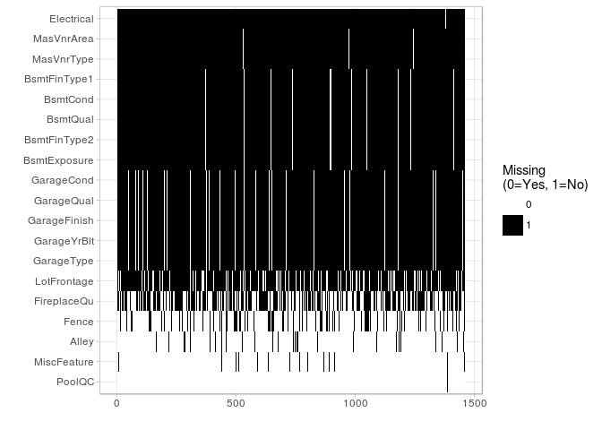

Predicion variable distribution
-------------------------------

    par(mfrow = c(1, 2))
    hist(train$SalePrice, main = "SalePrice")
    hist(log10(train$SalePrice), main = "Log10(SalePrice)")

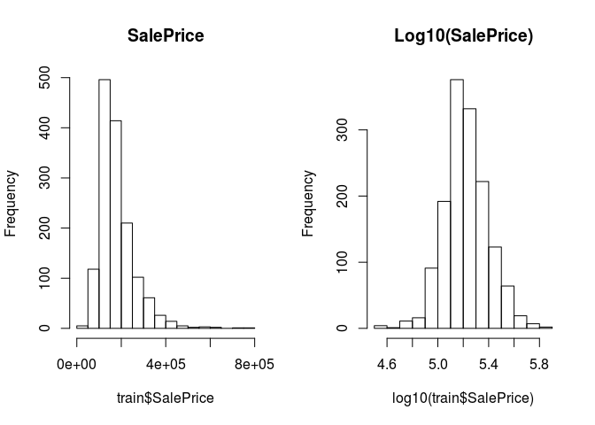

    par(mfrow = c(1, 2))
    boxplot(train$SalePrice, main = "SalePrice")
    boxplot(log10(train$SalePrice), main = "Log10(SalePrice)")

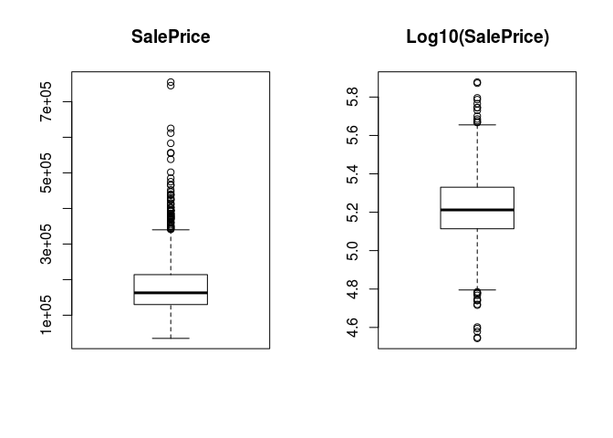

Los values (NA) count

    na_info <- apply(is.na(train), 2, sum)
    lost_values_info <- which(na_info > 0)
    filtered_lost_values_info <- na_info[lost_values_info]
    df_filtered_lost_values_info <- data.frame(filtered_lost_values_info)

    # TODO: Put dots instead of an histogram

    ggplot() + 
      geom_point(aes(x = rownames(df_filtered_lost_values_info), y = df_filtered_lost_values_info$filtered_lost_values_info)) +
      geom_hline(yintercept = nrow(train)*0.05, color = 'pink') + 
      geom_hline(yintercept = nrow(train)*0.10, color = 'orange') +
      geom_hline(yintercept = nrow(train)*0.20, color = 'blue') + 
      theme(axis.text.x = element_text(angle = 90, hjust = 1)) +
      xlab('Features with lost values') +
      ylab('Number of lost values')

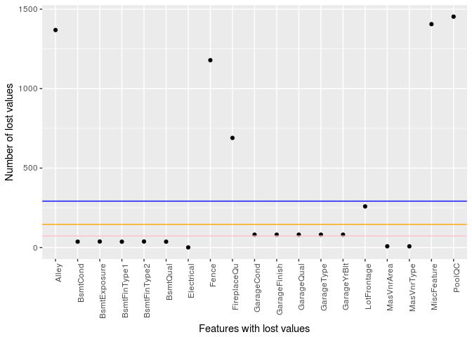

-   Distribución de los valores perdidos en función de la variable
    Log(SalePrice) -

<!-- -->

    for(feature in names(filtered_lost_values_info)) {
      categories <- train[, feature]
      print(ggplot(data = train, aes(x = feature, y = log(SalePrice), fill = categories)) +
            geom_boxplot())
    }

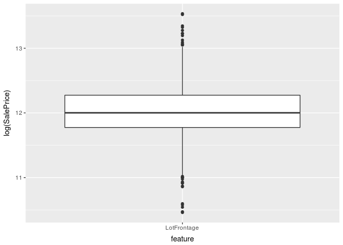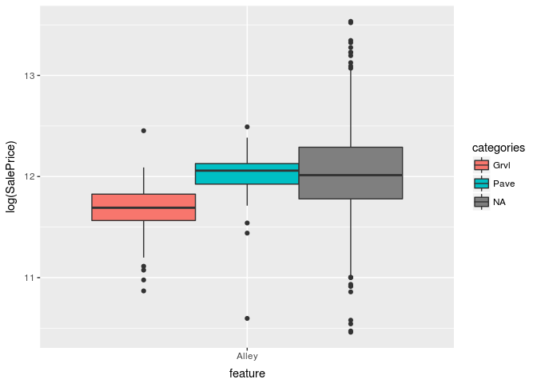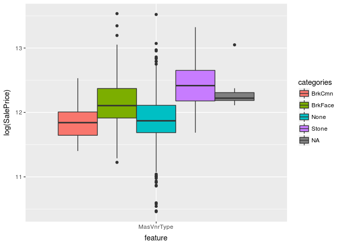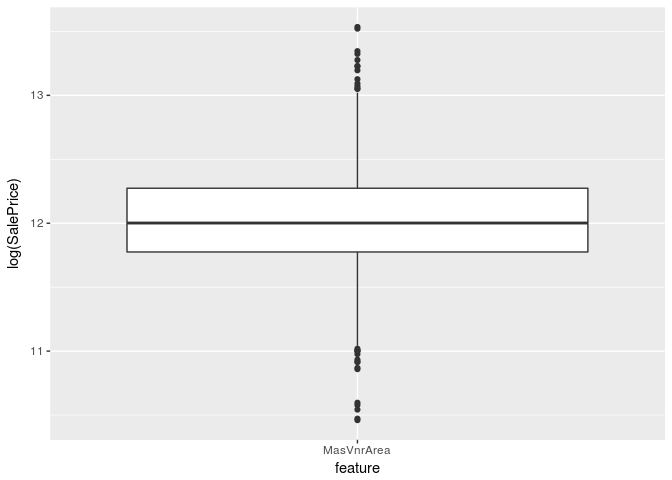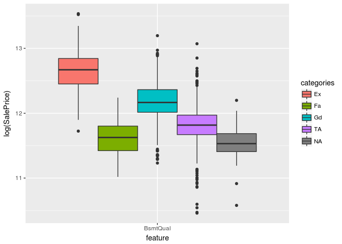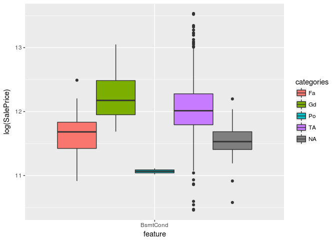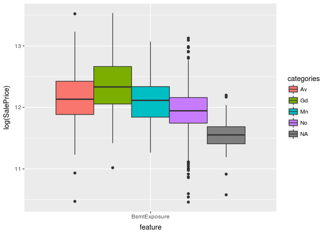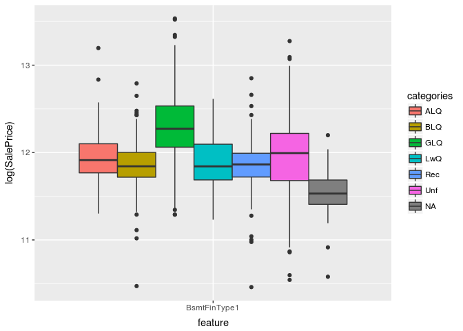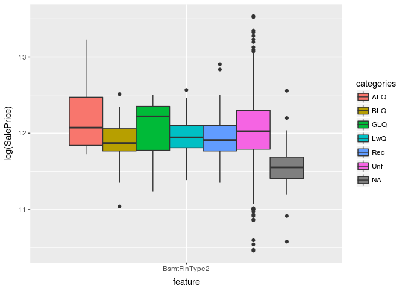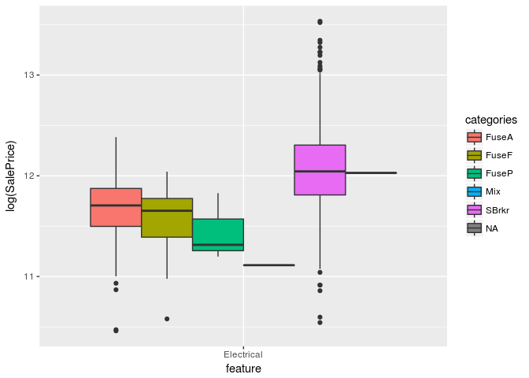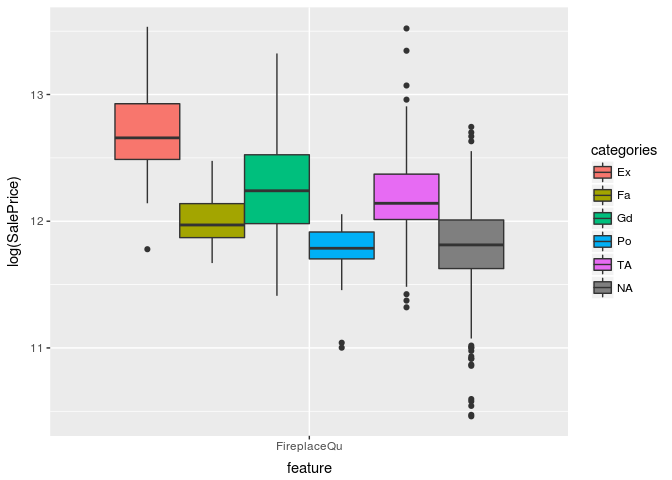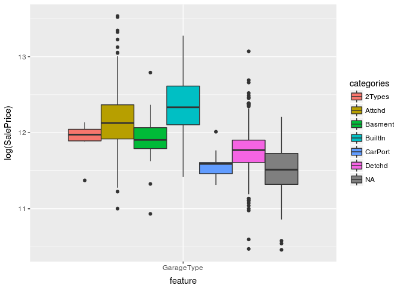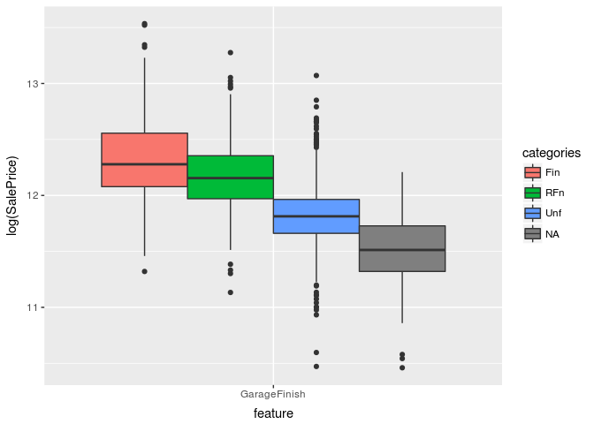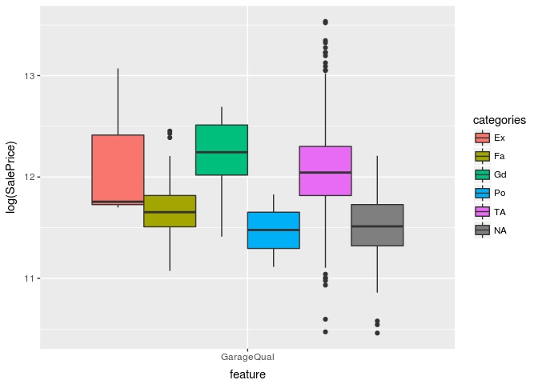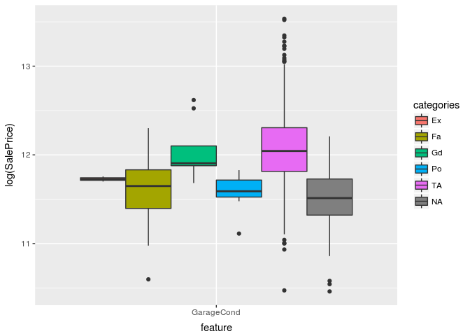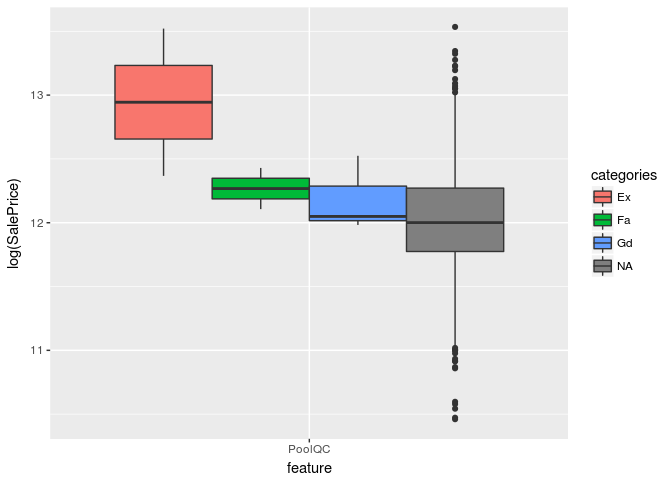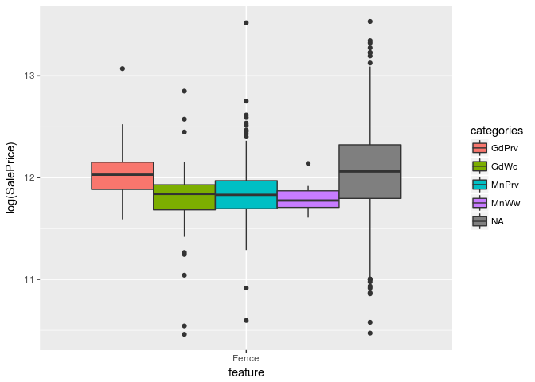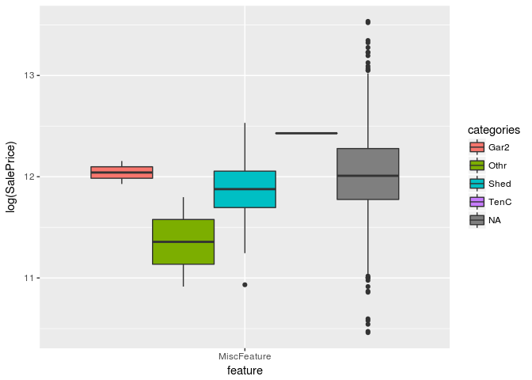

-Examinamos la distribución de las variables continuas con respecto a
Log(SalePrice)-

    numeric_features <- numeric <- names(train)[which(sapply(train, is.numeric))]
    numeric_feature_with_lost_values <- intersect(numeric_features, names(filtered_lost_values_info))
    for(feature in numeric_feature_with_lost_values) {
      print(ggplot(data = train, aes(x = train[, feature], y = log(train$SalePrice))) + 
              geom_point() + 
              geom_smooth(method="lm") + 
              xlab(label = feature))
    }

    ## Warning: Removed 259 rows containing non-finite values (stat_smooth).

    ## Warning: Removed 259 rows containing missing values (geom_point).

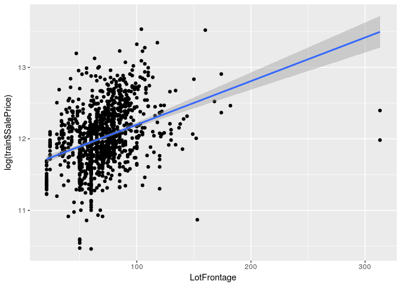

    ## Warning: Removed 8 rows containing non-finite values (stat_smooth).

    ## Warning: Removed 8 rows containing missing values (geom_point).

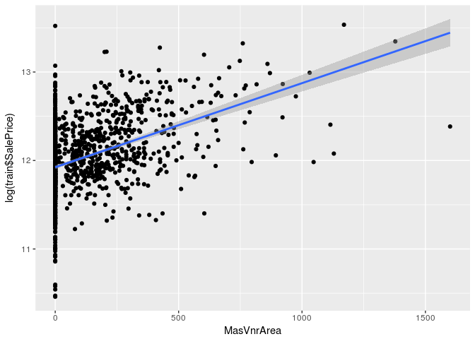

    ## Warning: Removed 81 rows containing non-finite values (stat_smooth).

    ## Warning: Removed 81 rows containing missing values (geom_point).

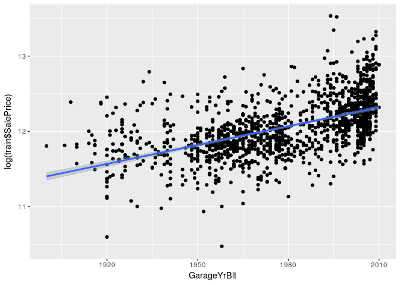

-GarageYrBlt- Se aprecia que es una propidad que, lógicamente, está muy
relacionada con YearBuilt (año de construcción). En general, se puede
decir que GarageYrBlt tiende a ser igual a YearBuilt. Por consiguiente,
en los valores perdidos de GarageYrBlt, se procede a asígnar el
correspondiente valor de YearBuilt.

    ggplot(data = train, aes(x = train$GarageYrBlt, y = train$YearBuilt)) + 
              geom_point() + 
              geom_smooth(method="lm")

    ## Warning: Removed 81 rows containing non-finite values (stat_smooth).

    ## Warning: Removed 81 rows containing missing values (geom_point).

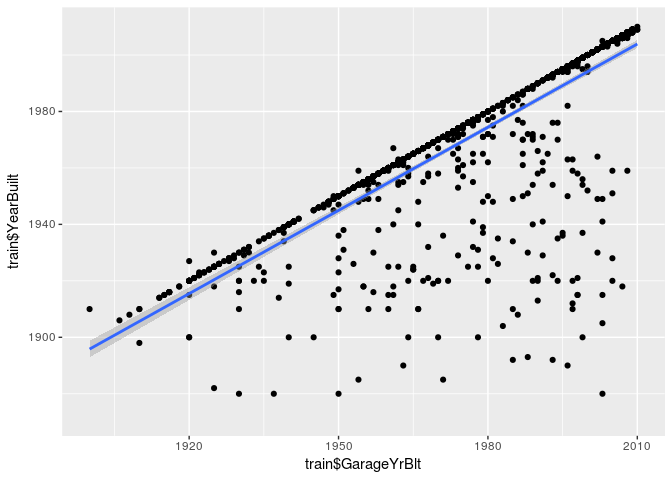

    train$GarageYrBlt[is.na(train$GarageYrBlt)] <- train$YearBuilt[is.na(train$GarageYrBlt)]

-LotFrontage- Por lógica, se puede decir que el área de la propiedad con
la longitud de la fachada. Para confirmarlo, comprobamos la correlación
entre ellas:

    cor(train$LotFrontage, train$LotArea, use = "complete.obs")

    ## [1] 0.426095

    cor(log(train$LotFrontage), log(train$LotArea), use = "complete.obs")

    ## [1] 0.7455501

Y visualizamos su relación:

    ggplot(data = train, aes(x = train$LotArea, y = train$LotFrontage)) + 
      geom_point() + 
      geom_smooth(method="lm")

    ## Warning: Removed 259 rows containing non-finite values (stat_smooth).

    ## Warning: Removed 259 rows containing missing values (geom_point).

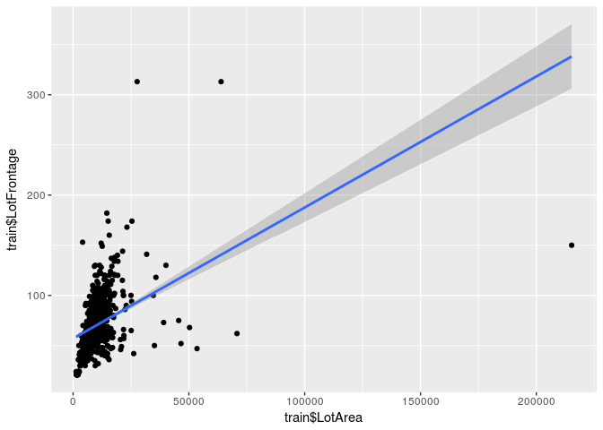

    ggplot(data = train, aes(x = log(train$LotArea), y = log(train$LotFrontage))) + 
              geom_point() + 
              geom_smooth(method="lm")

    ## Warning: Removed 259 rows containing non-finite values (stat_smooth).

    ## Warning: Removed 259 rows containing missing values (geom_point).

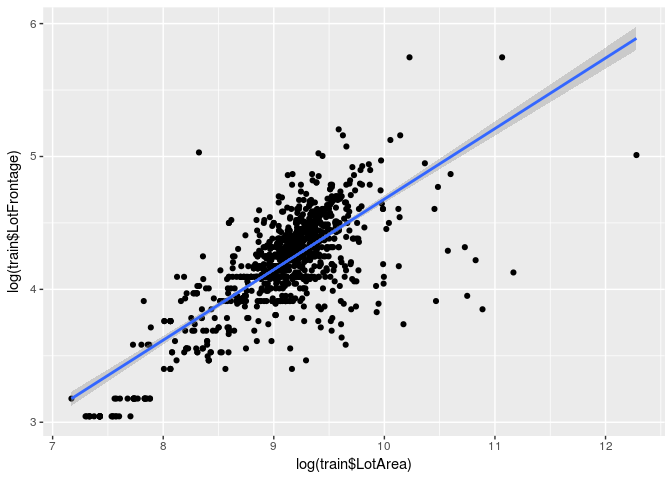

Se puede confirmar que existe una alta correlación directa entre
*LotFrontage* con *LotArea*. Dado, que estas dos propiedades están
relacionadas, seguramente una de ellas sea desechada en el proceso de
selección de variables. Idependientemente de ello, en este paso
sustituiremos los valores de *LotFrontage*, por la mediana de los
valores existentes.

    train$LotFrontage[is.na(train$LotFrontage)] <- median(train$LotFrontage[!is.na(train$LotFrontage)])
    cor(train$LotFrontage, train$LotArea, use = "complete.obs")

    ## [1] 0.3045222

    cor(log(train$LotFrontage), log(train$LotArea), use = "complete.obs")

    ## [1] 0.6534162

Observamos que la correlación continúa siendo similar después de tratar
los valores perdidos en *LotFrontage*.

**TODO:** Quizás remplazar con la media no sea la mejor opción (cambia
bastante la correlación). Si no se encuentra una solución mejor, quizás
habría que cargarse directamente la variable.

    ggplot(data = train, aes(x = log(train$LotArea), y = log(train$LotFrontage))) + 
              geom_point() + 
              geom_smooth(method="lm")

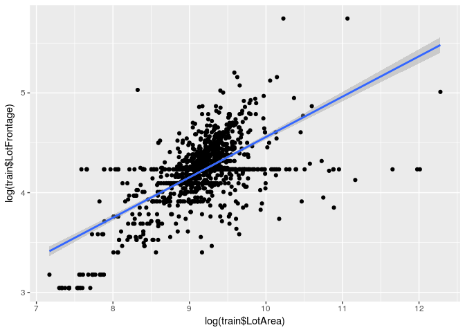

-   MasVnrArea- Existe una gran cantidad de entradas con valor 0. Esto
    seguramente se deba a la carencia de "chapado":

<!-- -->

    qplot(data = train, x = log(MasVnrArea), y = log(SalePrice), col = MasVnrType)

    ## Warning: Removed 8 rows containing missing values (geom_point).

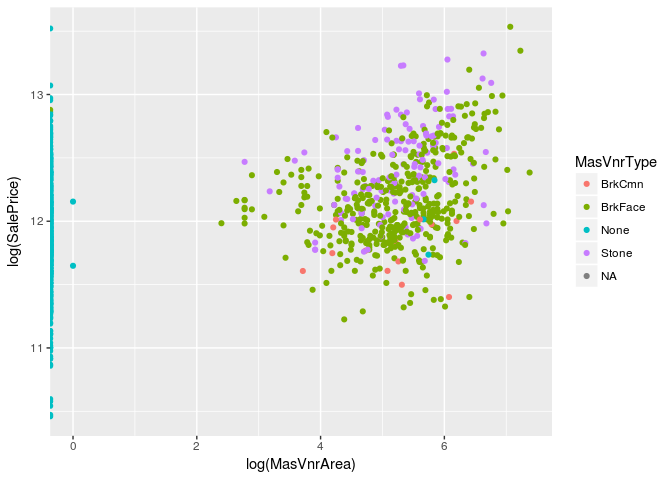

También observamos que en ambas variables los valores perdidos (8)
forman parte de los mismos ejemplos:

    ifelse(train$Id[is.na(train$MasVnrArea)] == train$Id[is.na(train$MasVnrType)], "Equals", "Non equals")

    ## [1] "Equals" "Equals" "Equals" "Equals" "Equals" "Equals" "Equals" "Equals"

Se elimina la caraterística *MasVnrArea* ya que las entradas con valor
0, por ser del tipo "None", hacen que la información desprendida de la
variable esté "deformada".

    # TODO: cambiar la forma de eleminar las columnas para que no se parezca tanto
    train <- dplyr::select(train, -MasVnrArea)

Observamos *MasVnrType* en relación a *SalePrice* para entender su
distribución.

    qplot(data = train, x = train$MasVnrType, y = log10(train$SalePrice), geom = c("boxplot"), fill = train$MasVnrType)

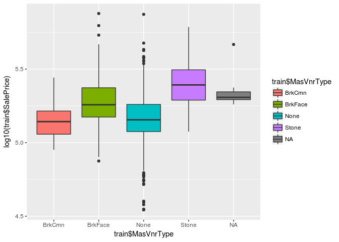

Asignamos a los valores perdidos el tipo "BrkFace", por mayor proximidad
de sus medias. Aunque también se podría asignar "Stone".

    train$MasVnrType[is.na(train$MasVnrType)] <- "BrkFace"

    qplot(data = train, x = train$MasVnrType, y = log10(train$SalePrice), geom = c("boxplot"), fill = train$MasVnrType)

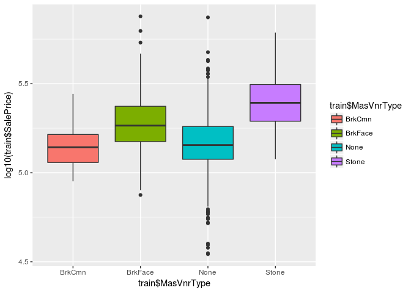

Variables categ?ricas
---------------------

Las siguientes caraterísticas contienen valores perdidos que representan
la ausencia de la propiedad a la que representan. Por consiguiente, se
le asignarán el tipo "None" a aquellos valores ausentes (NA). Dichas
características son: *PoolQC*, *MiscFeature*, *Alley*, *Fence*,
*FireplaceQu*, *GarageCond*, *GarageFinish*, *GarageQual*, *GarageType*,
*BsmtCond*, *BsmtExposure*, *BsmtFinType1*, *BsmtFinType2* y *BsmtQual*.

    none_types <-
      c(
      "PoolQC",
      "MiscFeature",
      "Alley",
      "Fence",
      "FireplaceQu",
      "GarageCond",
      "GarageFinish",
      "GarageQual",
      "GarageType",
      "BsmtCond",
      "BsmtExposure",
      "BsmtFinType1",
      "BsmtFinType2",
      "BsmtQual"
      )
      
      for (none in none_types) {
        if(is.factor(train[, none])) {
          train[, none] <- as.character(train[, none])
          train[, none][which(is.na(train[, none]))] <- "None"
          train[, none] <- factor(train[, none])
        } else {
          print(length(train[, none][is.na(train[, none])]))
          train[, none][is.na(train[, none])] <- "None"
        }
      }

-Electrical- Un valor perdido. Se le asigna el tipo mayoritario.

    train$Electrical[is.na(train$Electrical)] <- names(sort(summary(train$Electrical), decreasing = T)[1])

As? mismo, hay que eliminar la propiedad Id

    train <- dplyr::select(train, -Id)

Correcci?n de valores perdidos en el conjunto de test
=====================================================

    na_info_test <- apply(is.na(test), 2, sum)
    lost_values_info_test <- which(na_info_test > 0)
    filtered_lost_values_info_test <- na_info_test[lost_values_info_test]
    df_filtered_lost_values_info_test <- data.frame(filtered_lost_values_info_test)
    # TODO: Change and add a histogram
    ggplot() + 
      geom_point(aes(x = rownames(df_filtered_lost_values_info_test), y = df_filtered_lost_values_info_test$filtered_lost_values_info_test)) +
      geom_hline(yintercept = nrow(test)*0.05, color = 'pink') + 
      geom_hline(yintercept = nrow(test)*0.10, color = 'orange') +
      geom_hline(yintercept = nrow(test)*0.20, color = 'blue') + 
      theme(axis.text.x = element_text(angle = 90, hjust = 1)) +
      xlab('Features with lost values') +
      ylab('Number of lost values')

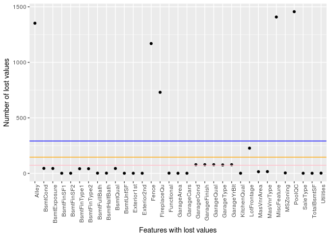

Mismas transformaciones que en el conjunto de entrenamiento

      for (none in none_types) {
        if(is.factor(test[, none])) {
          test[, none] <- as.character(test[, none])
          test[, none][which(is.na(test[, none]))] <- "None"
          test[, none] <- factor(test[, none])
        } else {
          print(length(test[, none][is.na(test[, none])]))
          test[, none][is.na(test[, none])] <- "None"
        }
      }

    test$GarageYrBlt[is.na(test$GarageYrBlt)] <- test$YearBuilt[is.na(test$GarageYrBlt)]
    test$LotFrontage[is.na(test$LotFrontage)] <- median(test$LotFrontage[!is.na(test$LotFrontage)])
    test <- dplyr::select(test, -MasVnrArea)
    test$MasVnrType[is.na(test$MasVnrType)] <- "Stone"

    test <- dplyr::select(test, -Id)

Ahora las dem?s variables que sean num?ricas (se les asigna la mediana)

    lost_test <- c("BsmtFinSF1", "BsmtFinSF2", "BsmtUnfSF", "TotalBsmtSF", "BsmtFullBath", "BsmtHalfBath", "GarageCars", "GarageArea")

    for(lost in lost_test) {
      test[, lost][is.na(test[, lost])] <- median(test[, lost][!is.na(test[, lost])])
    }

Ahora las nominales (se les asigna la moda)

    lost_nominal_test <- c("Exterior1st", "Exterior2nd", "Functional", "KitchenQual", "MSZoning", "SaleType", "Utilities")

    for(lost in lost_nominal_test) {
      test[, lost][is.na(test[, lost])] <- names(sort(summary(test[, lost]), decreasing = T)[1])
    }

Transformaci?n de datos
=======================

Regularizaci?n de las variables continuas
-----------------------------------------

    transformed_train <- train
    transformed_test <- test
    transformed_train$SalePrice <- log(transformed_train$SalePrice)

    for (feature in names(transformed_train)) {
      if(is.numeric(transformed_train[, feature])) {
        print(ggplot2::ggplot(data = transformed_train, aes(x = transformed_train[, feature])) +
                          geom_density() +
                          xlab(feature))
      }
    }

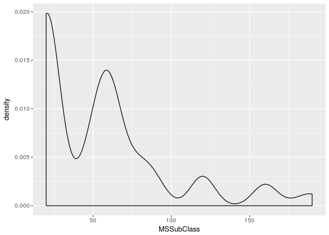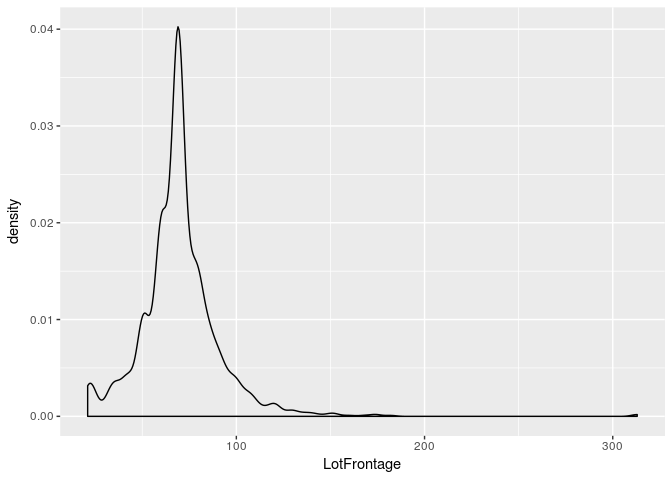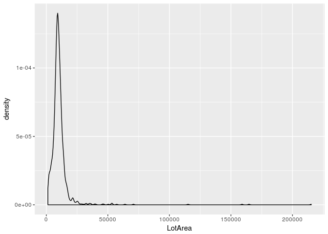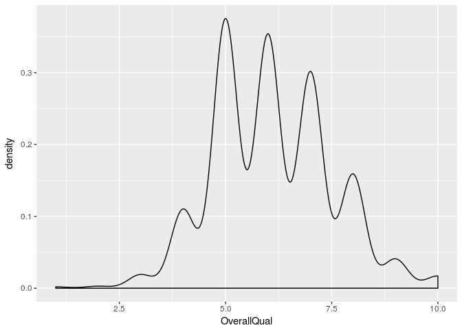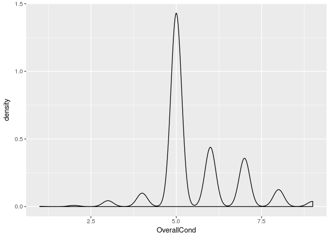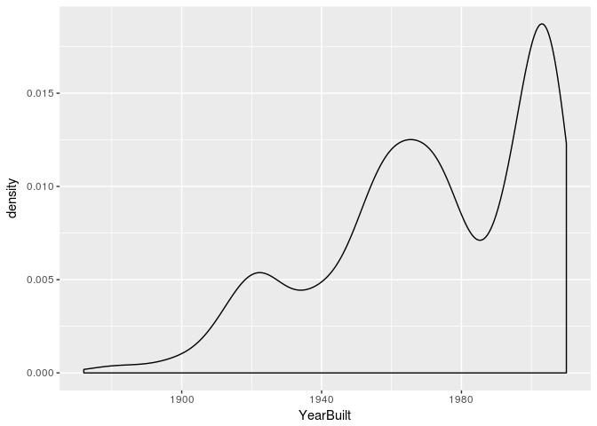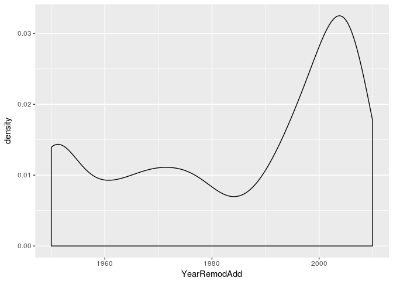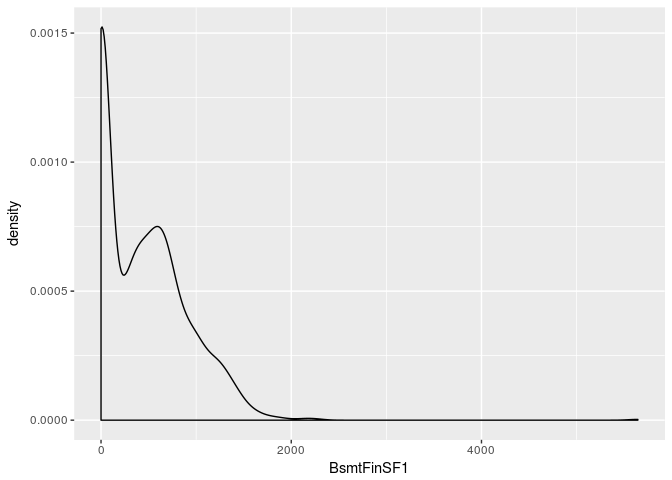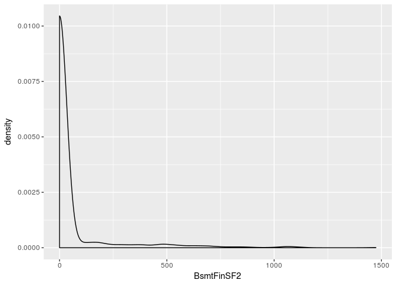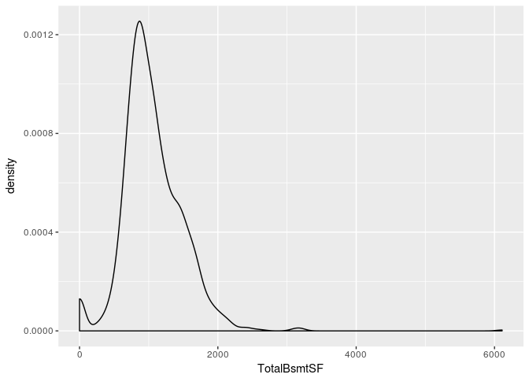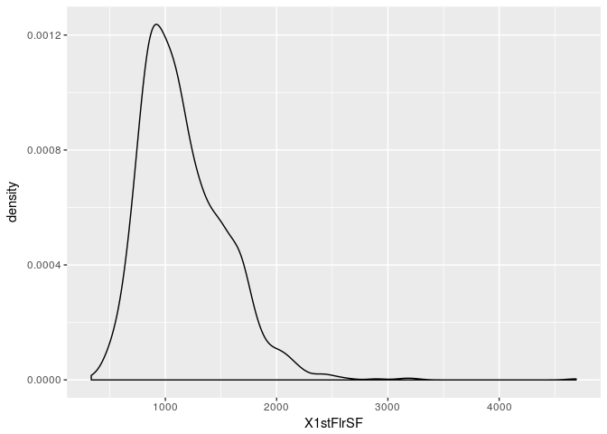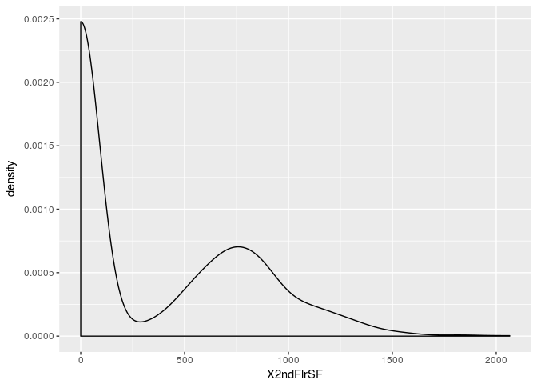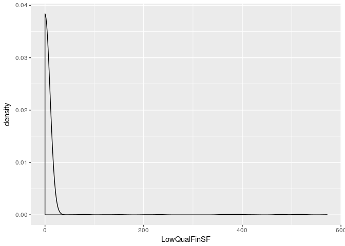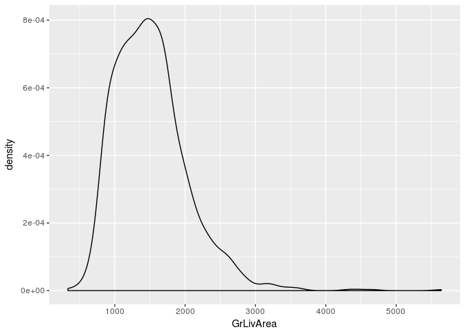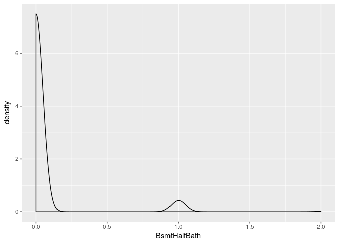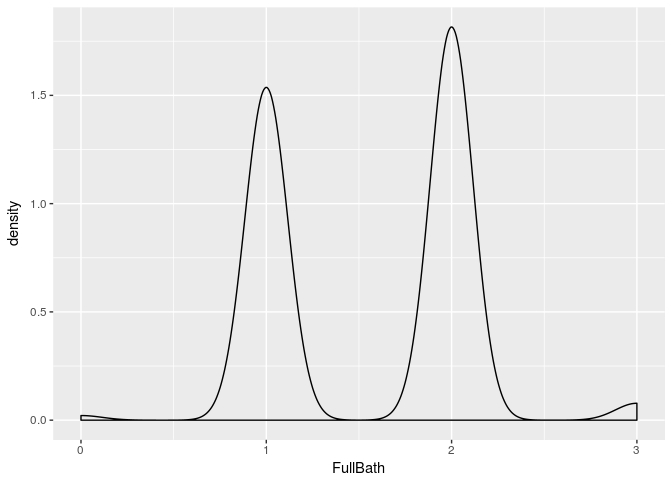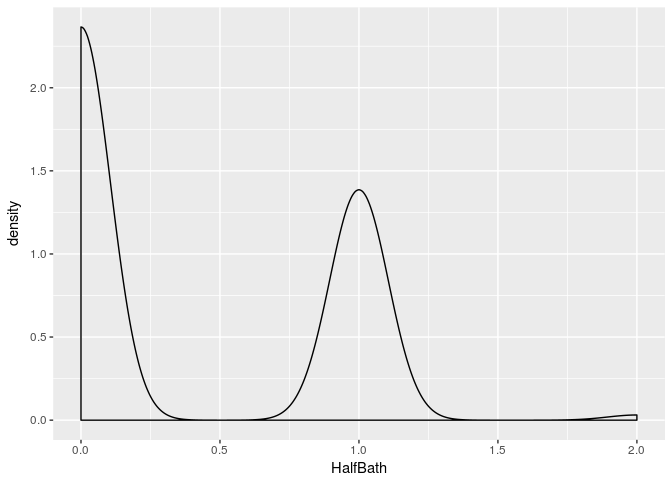

Let's normalize the continuous values

    features_to_center <- c("MSSubClass", "LotFrontage", "LotArea", "BsmtFinSF1", "BsmtUnfSF", "TotalBsmtSF", "X1stFlrSF", "X2ndFlrSF", "LowQualFinSF", "GrLivArea", "BsmtFullBath", "BsmtHalfBath", "WoodDeckSF", "OpenPorchSF", "EnclosedPorch", "X3SsnPorch", "ScreenPorch", "PoolArea", "MiscVal")
    feaures_to_normalize <- c("OverallQual", "OverallCond", "GareageArea", "MoSold")

      train_pre_processed_values <- caret::preProcess(transformed_train, method = c("center", "scale"))
      test_pre_processed_values <- caret::preProcess(transformed_test, method = c("center", "scale"))

Selecci?n de variables
======================

lm
--

    exploratory_lm = lm(SalePrice ~ . -1, data = transformed_train)
    summary(exploratory_lm)

    ## 
    ## Call:
    ## lm(formula = SalePrice ~ . - 1, data = transformed_train)
    ## 
    ## Residuals:
    ##      Min       1Q   Median       3Q      Max 
    ## -0.69597 -0.04631  0.00285  0.05014  0.69597 
    ## 
    ## Coefficients: (8 not defined because of singularities)
    ##                        Estimate Std. Error t value Pr(>|t|)    
    ## MSSubClass           -3.850e-04  3.800e-04  -1.013 0.311226    
    ## MSZoningC (all)       6.682e+00  4.864e+00   1.374 0.169760    
    ## MSZoningFV            7.128e+00  4.864e+00   1.466 0.143023    
    ## MSZoningRH            7.111e+00  4.861e+00   1.463 0.143719    
    ## MSZoningRL            7.105e+00  4.861e+00   1.462 0.144123    
    ## MSZoningRM            7.067e+00  4.862e+00   1.453 0.146363    
    ## LotFrontage           3.967e-04  2.015e-04   1.969 0.049184 *  
    ## LotArea               2.898e-06  5.021e-07   5.772 9.97e-09 ***
    ## StreetPave            9.658e-02  5.598e-02   1.725 0.084724 .  
    ## AlleyNone            -1.108e-02  1.939e-02  -0.571 0.567895    
    ## AlleyPave             1.544e-02  2.768e-02   0.558 0.576921    
    ## LotShapeIR2           2.571e-02  1.938e-02   1.327 0.184904    
    ## LotShapeIR3           1.208e-02  4.072e-02   0.297 0.766791    
    ## LotShapeReg           7.407e-03  7.358e-03   1.007 0.314305    
    ## LandContourHLS        2.803e-02  2.354e-02   1.191 0.234005    
    ## LandContourLow       -1.810e-02  2.936e-02  -0.616 0.537821    
    ## LandContourLvl        2.812e-02  1.702e-02   1.652 0.098883 .  
    ## UtilitiesNoSeWa      -2.317e-01  1.204e-01  -1.925 0.054524 .  
    ## LotConfigCulDSac      2.779e-02  1.518e-02   1.830 0.067427 .  
    ## LotConfigFR2         -3.613e-02  1.845e-02  -1.959 0.050394 .  
    ## LotConfigFR3         -9.183e-02  5.759e-02  -1.594 0.111093    
    ## LotConfigInside      -1.458e-02  8.212e-03  -1.776 0.076062 .  
    ## LandSlopeMod          3.032e-02  1.828e-02   1.659 0.097365 .  
    ## LandSlopeSev         -1.979e-01  5.247e-02  -3.773 0.000169 ***
    ## NeighborhoodBlueste  -4.177e-02  8.833e-02  -0.473 0.636356    
    ## NeighborhoodBrDale   -6.766e-02  4.961e-02  -1.364 0.172841    
    ## NeighborhoodBrkSide  -1.100e-03  4.324e-02  -0.025 0.979708    
    ## NeighborhoodClearCr   1.839e-02  4.208e-02   0.437 0.662101    
    ## NeighborhoodCollgCr  -2.559e-02  3.299e-02  -0.776 0.438070    
    ## NeighborhoodCrawfor   1.106e-01  3.892e-02   2.840 0.004583 ** 
    ## NeighborhoodEdwards  -9.364e-02  3.645e-02  -2.569 0.010310 *  
    ## NeighborhoodGilbert  -2.221e-02  3.495e-02  -0.635 0.525234    
    ## NeighborhoodIDOTRR   -3.649e-02  4.903e-02  -0.744 0.456909    
    ## NeighborhoodMeadowV  -1.714e-01  5.091e-02  -3.366 0.000786 ***
    ## NeighborhoodMitchel  -6.034e-02  3.721e-02  -1.622 0.105140    
    ## NeighborhoodNAmes    -4.519e-02  3.567e-02  -1.267 0.205424    
    ## NeighborhoodNoRidge   2.587e-02  3.753e-02   0.689 0.490747    
    ## NeighborhoodNPkVill  -3.078e-03  6.432e-02  -0.048 0.961843    
    ## NeighborhoodNridgHt   7.115e-02  3.392e-02   2.097 0.036183 *  
    ## NeighborhoodNWAmes   -4.785e-02  3.644e-02  -1.313 0.189342    
    ## NeighborhoodOldTown  -5.558e-02  4.412e-02  -1.260 0.207969    
    ## NeighborhoodSawyer   -3.632e-02  3.707e-02  -0.980 0.327406    
    ## NeighborhoodSawyerW  -1.183e-02  3.546e-02  -0.334 0.738636    
    ## NeighborhoodSomerst   1.414e-02  4.103e-02   0.345 0.730485    
    ## NeighborhoodStoneBr   1.314e-01  3.756e-02   3.499 0.000485 ***
    ## NeighborhoodSWISU    -2.122e-03  4.430e-02  -0.048 0.961798    
    ## NeighborhoodTimber   -1.106e-03  3.703e-02  -0.030 0.976166    
    ## NeighborhoodVeenker   4.041e-02  4.800e-02   0.842 0.400002    
    ## Condition1Feedr       3.952e-02  2.303e-02   1.717 0.086326 .  
    ## Condition1Norm        8.879e-02  1.923e-02   4.617 4.31e-06 ***
    ## Condition1PosA        3.266e-02  4.598e-02   0.710 0.477655    
    ## Condition1PosN        9.262e-02  3.418e-02   2.710 0.006823 ** 
    ## Condition1RRAe       -3.555e-02  4.166e-02  -0.853 0.393621    
    ## Condition1RRAn        6.011e-02  3.192e-02   1.883 0.059972 .  
    ## Condition1RRNe        1.668e-02  8.033e-02   0.208 0.835561    
    ## Condition1RRNn        9.027e-02  5.898e-02   1.531 0.126143    
    ## Condition2Feedr       1.070e-01  1.076e-01   0.995 0.319960    
    ## Condition2Norm        4.107e-02  9.323e-02   0.441 0.659633    
    ## Condition2PosA        2.352e-01  1.699e-01   1.384 0.166643    
    ## Condition2PosN       -8.363e-01  1.268e-01  -6.593 6.41e-11 ***
    ## Condition2RRAe       -6.238e-01  2.992e-01  -2.085 0.037268 *  
    ## Condition2RRAn       -5.960e-02  1.447e-01  -0.412 0.680479    
    ## Condition2RRNn        3.347e-02  1.245e-01   0.269 0.788023    
    ## BldgType2fmCon        4.794e-02  5.734e-02   0.836 0.403244    
    ## BldgTypeDuplex        2.211e-03  3.398e-02   0.065 0.948141    
    ## BldgTypeTwnhs        -4.532e-02  4.599e-02  -0.985 0.324633    
    ## BldgTypeTwnhsE       -1.083e-02  4.148e-02  -0.261 0.794115    
    ## HouseStyle1.5Unf      1.078e-02  3.647e-02   0.296 0.767481    
    ## HouseStyle1Story     -2.775e-02  2.010e-02  -1.381 0.167653    
    ## HouseStyle2.5Fin     -1.049e-01  5.691e-02  -1.844 0.065431 .  
    ## HouseStyle2.5Unf      3.432e-02  4.224e-02   0.812 0.416684    
    ## HouseStyle2Story     -2.301e-02  1.607e-02  -1.432 0.152417    
    ## HouseStyleSFoyer     -9.464e-03  2.874e-02  -0.329 0.742020    
    ## HouseStyleSLvl       -9.047e-04  2.553e-02  -0.035 0.971737    
    ## OverallQual           4.096e-02  4.657e-03   8.795  < 2e-16 ***
    ## OverallCond           3.667e-02  4.008e-03   9.147  < 2e-16 ***
    ## YearBuilt             1.724e-03  3.695e-04   4.667 3.40e-06 ***
    ## YearRemodAdd          8.307e-04  2.550e-04   3.258 0.001153 ** 
    ## RoofStyleGable        7.400e-03  8.478e-02   0.087 0.930461    
    ## RoofStyleGambrel      1.272e-02  9.284e-02   0.137 0.891066    
    ## RoofStyleHip          9.963e-03  8.508e-02   0.117 0.906797    
    ## RoofStyleMansard      6.011e-02  9.848e-02   0.610 0.541705    
    ## RoofStyleShed         4.509e-01  1.588e-01   2.840 0.004588 ** 
    ## RoofMatlCompShg       2.577e+00  2.424e-01  10.631  < 2e-16 ***
    ## RoofMatlMembran       2.987e+00  2.877e-01  10.383  < 2e-16 ***
    ## RoofMatlMetal         2.858e+00  2.858e-01   9.999  < 2e-16 ***
    ## RoofMatlRoll          2.599e+00  2.681e-01   9.696  < 2e-16 ***
    ## RoofMatlTar&Grv       2.582e+00  2.599e-01   9.936  < 2e-16 ***
    ## RoofMatlWdShake       2.523e+00  2.531e-01   9.967  < 2e-16 ***
    ## RoofMatlWdShngl       2.633e+00  2.468e-01  10.666  < 2e-16 ***
    ## Exterior1stAsphShn   -1.609e-02  1.516e-01  -0.106 0.915470    
    ## Exterior1stBrkComm   -2.192e-01  1.277e-01  -1.716 0.086432 .  
    ## Exterior1stBrkFace    7.564e-02  5.872e-02   1.288 0.197906    
    ## Exterior1stCBlock    -5.904e-02  1.254e-01  -0.471 0.637781    
    ## Exterior1stCemntBd   -1.023e-01  8.756e-02  -1.168 0.243053    
    ## Exterior1stHdBoard   -2.621e-02  5.955e-02  -0.440 0.659939    
    ## Exterior1stImStucc    9.195e-03  1.294e-01   0.071 0.943345    
    ## Exterior1stMetalSd    3.357e-02  6.715e-02   0.500 0.617214    
    ## Exterior1stPlywood   -1.775e-02  5.878e-02  -0.302 0.762760    
    ## Exterior1stStone      1.113e-02  1.117e-01   0.100 0.920619    
    ## Exterior1stStucco     9.151e-03  6.480e-02   0.141 0.887720    
    ## Exterior1stVinylSd   -1.948e-02  6.135e-02  -0.317 0.750933    
    ## Exterior1stWd Sdng   -5.341e-02  5.696e-02  -0.938 0.348570    
    ## Exterior1stWdShing   -1.411e-02  6.150e-02  -0.229 0.818537    
    ## Exterior2ndAsphShn    6.684e-02  1.020e-01   0.655 0.512533    
    ## Exterior2ndBrk Cmn    5.983e-02  9.230e-02   0.648 0.516926    
    ## Exterior2ndBrkFace   -1.636e-02  6.080e-02  -0.269 0.787869    
    ## Exterior2ndCBlock            NA         NA      NA       NA    
    ## Exterior2ndCmentBd    1.553e-01  8.606e-02   1.804 0.071464 .  
    ## Exterior2ndHdBoard    4.095e-02  5.715e-02   0.717 0.473732    
    ## Exterior2ndImStucc    4.789e-02  6.596e-02   0.726 0.467996    
    ## Exterior2ndMetalSd    1.080e-02  6.537e-02   0.165 0.868785    
    ## Exterior2ndOther     -5.852e-02  1.245e-01  -0.470 0.638459    
    ## Exterior2ndPlywood    3.859e-02  5.548e-02   0.696 0.486858    
    ## Exterior2ndStone     -2.676e-02  7.877e-02  -0.340 0.734080    
    ## Exterior2ndStucco     3.616e-02  6.262e-02   0.577 0.563744    
    ## Exterior2ndVinylSd    5.876e-02  5.892e-02   0.997 0.318849    
    ## Exterior2ndWd Sdng    7.643e-02  5.496e-02   1.391 0.164550    
    ## Exterior2ndWd Shng    4.016e-02  5.735e-02   0.700 0.483920    
    ## MasVnrTypeBrkFace     3.517e-02  3.139e-02   1.120 0.262746    
    ## MasVnrTypeNone        2.685e-02  3.102e-02   0.866 0.386813    
    ## MasVnrTypeStone       4.623e-02  3.320e-02   1.393 0.163961    
    ## ExterQualFa           1.491e-02  5.089e-02   0.293 0.769596    
    ## ExterQualGd          -1.084e-03  2.178e-02  -0.050 0.960325    
    ## ExterQualTA           8.151e-03  2.426e-02   0.336 0.736892    
    ## ExterCondFa          -1.063e-01  8.303e-02  -1.280 0.200743    
    ## ExterCondGd          -8.315e-02  7.923e-02  -1.049 0.294214    
    ## ExterCondPo          -4.303e-02  1.456e-01  -0.295 0.767719    
    ## ExterCondTA          -6.113e-02  7.907e-02  -0.773 0.439593    
    ## FoundationCBlock      2.017e-02  1.460e-02   1.382 0.167373    
    ## FoundationPConc       3.795e-02  1.571e-02   2.415 0.015880 *  
    ## FoundationSlab       -2.384e-02  4.617e-02  -0.516 0.605710    
    ## FoundationStone       1.050e-01  5.247e-02   2.002 0.045515 *  
    ## FoundationWood       -1.248e-01  6.794e-02  -1.837 0.066411 .  
    ## BsmtQualFa           -2.361e-02  2.919e-02  -0.809 0.418789    
    ## BsmtQualGd           -2.723e-02  1.531e-02  -1.779 0.075482 .  
    ## BsmtQualNone          1.747e-01  1.684e-01   1.038 0.299585    
    ## BsmtQualTA           -2.924e-02  1.906e-02  -1.534 0.125235    
    ## BsmtCondGd            2.618e-02  2.427e-02   1.078 0.281029    
    ## BsmtCondNone                 NA         NA      NA       NA    
    ## BsmtCondPo            3.038e-01  1.372e-01   2.214 0.026983 *  
    ## BsmtCondTA            2.252e-02  1.952e-02   1.154 0.248853    
    ## BsmtExposureGd        3.157e-02  1.376e-02   2.294 0.021984 *  
    ## BsmtExposureMn       -6.883e-03  1.387e-02  -0.496 0.619847    
    ## BsmtExposureNo       -1.052e-02  1.001e-02  -1.051 0.293249    
    ## BsmtExposureNone     -5.232e-02  1.057e-01  -0.495 0.620719    
    ## BsmtFinType1BLQ      -5.228e-04  1.285e-02  -0.041 0.967563    
    ## BsmtFinType1GLQ       1.397e-02  1.159e-02   1.205 0.228412    
    ## BsmtFinType1LwQ      -2.453e-02  1.721e-02  -1.425 0.154347    
    ## BsmtFinType1None             NA         NA      NA       NA    
    ## BsmtFinType1Rec      -7.888e-03  1.378e-02  -0.572 0.567190    
    ## BsmtFinType1Unf      -1.167e-02  1.338e-02  -0.872 0.383510    
    ## BsmtFinSF1            1.480e-04  2.448e-05   6.044 2.00e-09 ***
    ## BsmtFinType2BLQ      -7.163e-02  3.479e-02  -2.059 0.039693 *  
    ## BsmtFinType2GLQ       5.731e-03  4.299e-02   0.133 0.893988    
    ## BsmtFinType2LwQ      -3.584e-02  3.401e-02  -1.054 0.292239    
    ## BsmtFinType2None     -1.484e-01  1.148e-01  -1.293 0.196363    
    ## BsmtFinType2Rec      -3.499e-02  3.269e-02  -1.070 0.284667    
    ## BsmtFinType2Unf      -2.076e-02  3.482e-02  -0.596 0.551152    
    ## BsmtFinSF2            1.387e-04  4.166e-05   3.330 0.000896 ***
    ## BsmtUnfSF             9.044e-05  2.244e-05   4.030 5.93e-05 ***
    ## TotalBsmtSF                  NA         NA      NA       NA    
    ## HeatingGasA           1.406e-01  1.174e-01   1.198 0.231337    
    ## HeatingGasW           2.119e-01  1.211e-01   1.751 0.080273 .  
    ## HeatingGrav          -4.386e-02  1.289e-01  -0.340 0.733708    
    ## HeatingOthW           1.480e-01  1.445e-01   1.024 0.306014    
    ## HeatingWall           2.131e-01  1.366e-01   1.560 0.119049    
    ## HeatingQCFa          -1.549e-02  2.166e-02  -0.715 0.474617    
    ## HeatingQCGd          -2.058e-02  9.497e-03  -2.166 0.030476 *  
    ## HeatingQCPo          -1.025e-01  1.221e-01  -0.840 0.401064    
    ## HeatingQCTA          -3.340e-02  9.516e-03  -3.510 0.000464 ***
    ## CentralAirY           6.085e-02  1.778e-02   3.422 0.000643 ***
    ## ElectricalFuseF      -6.155e-03  2.641e-02  -0.233 0.815788    
    ## ElectricalFuseP      -8.506e-02  8.547e-02  -0.995 0.319869    
    ## ElectricalMix        -2.511e-01  2.045e-01  -1.228 0.219726    
    ## ElectricalSBrkr      -1.583e-02  1.356e-02  -1.167 0.243382    
    ## X1stFlrSF             2.303e-04  2.598e-05   8.865  < 2e-16 ***
    ## X2ndFlrSF             2.292e-04  2.590e-05   8.849  < 2e-16 ***
    ## LowQualFinSF          1.988e-04  8.762e-05   2.269 0.023424 *  
    ## GrLivArea                    NA         NA      NA       NA    
    ## BsmtFullBath          2.491e-02  9.082e-03   2.742 0.006188 ** 
    ## BsmtHalfBath          5.767e-03  1.392e-02   0.414 0.678635    
    ## FullBath              1.842e-02  1.010e-02   1.823 0.068603 .  
    ## HalfBath              2.275e-02  9.624e-03   2.364 0.018223 *  
    ## BedroomAbvGr          6.179e-03  6.273e-03   0.985 0.324787    
    ## KitchenAbvGr         -4.539e-02  2.611e-02  -1.738 0.082434 .  
    ## KitchenQualFa        -5.916e-02  2.850e-02  -2.075 0.038173 *  
    ## KitchenQualGd        -6.555e-02  1.601e-02  -4.095 4.50e-05 ***
    ## KitchenQualTA        -6.590e-02  1.805e-02  -3.651 0.000273 ***
    ## TotRmsAbvGrd          4.246e-03  4.386e-03   0.968 0.333149    
    ## FunctionalMaj2       -2.536e-01  6.601e-02  -3.841 0.000129 ***
    ## FunctionalMin1        4.228e-02  3.951e-02   1.070 0.284813    
    ## FunctionalMin2        2.411e-02  3.963e-02   0.608 0.543077    
    ## FunctionalMod        -6.292e-02  4.850e-02  -1.297 0.194747    
    ## FunctionalSev        -2.645e-01  1.359e-01  -1.946 0.051856 .  
    ## FunctionalTyp         6.308e-02  3.421e-02   1.844 0.065432 .  
    ## Fireplaces            1.235e-02  1.175e-02   1.051 0.293282    
    ## FireplaceQuFa        -3.896e-03  3.164e-02  -0.123 0.902007    
    ## FireplaceQuGd         1.855e-02  2.446e-02   0.759 0.448217    
    ## FireplaceQuNone       9.030e-04  2.862e-02   0.032 0.974832    
    ## FireplaceQuPo         3.844e-02  3.640e-02   1.056 0.291147    
    ## FireplaceQuTA         1.886e-02  2.543e-02   0.742 0.458434    
    ## GarageTypeAttchd      1.080e-01  5.061e-02   2.134 0.033032 *  
    ## GarageTypeBasment     1.089e-01  5.872e-02   1.855 0.063848 .  
    ## GarageTypeBuiltIn     9.184e-02  5.277e-02   1.740 0.082085 .  
    ## GarageTypeCarPort     1.280e-01  6.754e-02   1.895 0.058344 .  
    ## GarageTypeDetchd      1.061e-01  5.064e-02   2.095 0.036374 *  
    ## GarageTypeNone        2.520e-02  9.550e-02   0.264 0.791921    
    ## GarageYrBlt          -9.934e-05  2.734e-04  -0.363 0.716436    
    ## GarageFinishNone             NA         NA      NA       NA    
    ## GarageFinishRFn       2.004e-03  9.006e-03   0.223 0.823941    
    ## GarageFinishUnf      -9.287e-03  1.116e-02  -0.832 0.405376    
    ## GarageCars            1.613e-02  1.046e-02   1.541 0.123473    
    ## GarageArea            1.214e-04  3.610e-05   3.363 0.000794 ***
    ## GarageQualFa         -3.873e-01  1.387e-01  -2.791 0.005334 ** 
    ## GarageQualGd         -3.333e-01  1.424e-01  -2.340 0.019423 *  
    ## GarageQualNone               NA         NA      NA       NA    
    ## GarageQualPo         -4.227e-01  1.771e-01  -2.387 0.017122 *  
    ## GarageQualTA         -3.388e-01  1.374e-01  -2.467 0.013780 *  
    ## GarageCondFa          2.836e-01  1.600e-01   1.773 0.076524 .  
    ## GarageCondGd          3.128e-01  1.662e-01   1.882 0.060074 .  
    ## GarageCondNone               NA         NA      NA       NA    
    ## GarageCondPo          4.443e-01  1.717e-01   2.588 0.009774 ** 
    ## GarageCondTA          3.041e-01  1.586e-01   1.918 0.055384 .  
    ## PavedDriveP          -1.300e-02  2.559e-02  -0.508 0.611542    
    ## PavedDriveY           1.189e-02  1.591e-02   0.747 0.454996    
    ## WoodDeckSF            9.614e-05  2.700e-05   3.560 0.000385 ***
    ## OpenPorchSF           2.744e-05  5.298e-05   0.518 0.604603    
    ## EnclosedPorch         1.225e-04  5.739e-05   2.134 0.033017 *  
    ## X3SsnPorch            1.536e-04  1.028e-04   1.494 0.135328    
    ## ScreenPorch           2.801e-04  5.745e-05   4.877 1.22e-06 ***
    ## PoolArea              1.665e-03  1.043e-03   1.596 0.110676    
    ## PoolQCFa             -1.309e-01  1.880e-01  -0.696 0.486379    
    ## PoolQCGd              3.319e-02  1.692e-01   0.196 0.844520    
    ## PoolQCNone            8.678e-01  5.642e-01   1.538 0.124283    
    ## FenceGdWo            -2.494e-02  2.255e-02  -1.106 0.268975    
    ## FenceMnPrv            3.169e-03  1.841e-02   0.172 0.863359    
    ## FenceMnWw            -1.098e-02  3.778e-02  -0.291 0.771271    
    ## FenceNone             1.442e-02  1.688e-02   0.854 0.393247    
    ## MiscFeatureNone      -1.460e-01  4.471e-01  -0.327 0.743972    
    ## MiscFeatureOthr      -1.783e-01  4.174e-01  -0.427 0.669278    
    ## MiscFeatureShed      -1.472e-01  4.283e-01  -0.344 0.731074    
    ## MiscFeatureTenC      -1.547e-01  4.442e-01  -0.348 0.727739    
    ## MiscVal              -6.705e-06  2.812e-05  -0.238 0.811620    
    ## MoSold               -5.519e-04  1.126e-03  -0.490 0.624157    
    ## YrSold               -2.410e-03  2.369e-03  -1.018 0.309077    
    ## SaleTypeCon           9.961e-02  8.066e-02   1.235 0.217080    
    ## SaleTypeConLD         1.293e-01  4.453e-02   2.903 0.003768 ** 
    ## SaleTypeConLI        -3.533e-02  5.312e-02  -0.665 0.506168    
    ## SaleTypeConLw         1.757e-02  5.587e-02   0.314 0.753260    
    ## SaleTypeCWD           6.071e-02  5.902e-02   1.028 0.303929    
    ## SaleTypeNew           6.811e-02  7.090e-02   0.961 0.336969    
    ## SaleTypeOth           6.667e-02  6.665e-02   1.000 0.317385    
    ## SaleTypeWD           -1.809e-02  1.921e-02  -0.942 0.346545    
    ## SaleConditionAdjLand  1.172e-01  6.712e-02   1.747 0.080972 .  
    ## SaleConditionAlloca   4.309e-02  4.068e-02   1.059 0.289713    
    ## SaleConditionFamily   1.347e-02  2.800e-02   0.481 0.630427    
    ## SaleConditionNormal   6.190e-02  1.334e-02   4.640 3.86e-06 ***
    ## SaleConditionPartial  2.049e-02  6.824e-02   0.300 0.764085    
    ## ---
    ## Signif. codes:  0 '***' 0.001 '**' 0.01 '*' 0.05 '.' 0.1 ' ' 1
    ## 
    ## Residual standard error: 0.1039 on 1209 degrees of freedom
    ## Multiple R-squared:  0.9999, Adjusted R-squared:  0.9999 
    ## F-statistic: 7.795e+04 on 251 and 1209 DF,  p-value: < 2.2e-16

Entrenamiento
=============

svmRadial
---------

    fit_control <- caret::trainControl(
      method = 'repeatedcv',
      number = 10,
      repeats = 1
      )
      
    model <- caret::train(SalePrice ~ . -1,
      data = transformed_train,
      method = 'svmRadial',
      trControl = fit_control)

    ## Warning in .local(x, ...): Variable(s) `' constant. Cannot scale data.

    ## Warning in .local(x, ...): Variable(s) `' constant. Cannot scale data.

    ## Warning in .local(x, ...): Variable(s) `' constant. Cannot scale data.

    ## Warning in .local(x, ...): Variable(s) `' constant. Cannot scale data.

    ## Warning in .local(x, ...): Variable(s) `' constant. Cannot scale data.

    ## Warning in .local(x, ...): Variable(s) `' constant. Cannot scale data.

    ## Warning in .local(x, ...): Variable(s) `' constant. Cannot scale data.

    ## Warning in .local(x, ...): Variable(s) `' constant. Cannot scale data.

    ## Warning in .local(x, ...): Variable(s) `' constant. Cannot scale data.

    ## Warning in .local(x, ...): Variable(s) `' constant. Cannot scale data.

    ## Warning in .local(x, ...): Variable(s) `' constant. Cannot scale data.

    ## Warning in .local(x, ...): Variable(s) `' constant. Cannot scale data.

    ## Warning in .local(x, ...): Variable(s) `' constant. Cannot scale data.

    ## Warning in .local(x, ...): Variable(s) `' constant. Cannot scale data.

    ## Warning in .local(x, ...): Variable(s) `' constant. Cannot scale data.

    ## Warning in .local(x, ...): Variable(s) `' constant. Cannot scale data.

    ## Warning in .local(x, ...): Variable(s) `' constant. Cannot scale data.

    ## Warning in .local(x, ...): Variable(s) `' constant. Cannot scale data.

    ## Warning in .local(x, ...): Variable(s) `' constant. Cannot scale data.

    ## Warning in .local(x, ...): Variable(s) `' constant. Cannot scale data.

    ## Warning in .local(x, ...): Variable(s) `' constant. Cannot scale data.

    test_predict <- stats::predict(model, transformed_test)

Submiting data
==============

    # prediction.table <- data.frame(Id = test$Id, SalePrice =  exp(test_predict))
    # colnames(prediction.table)[2] <- "SalePrice"
    # write.csv(prediction.table,paste0('svmRadial', "_predictions",".csv"), row.names = F)
